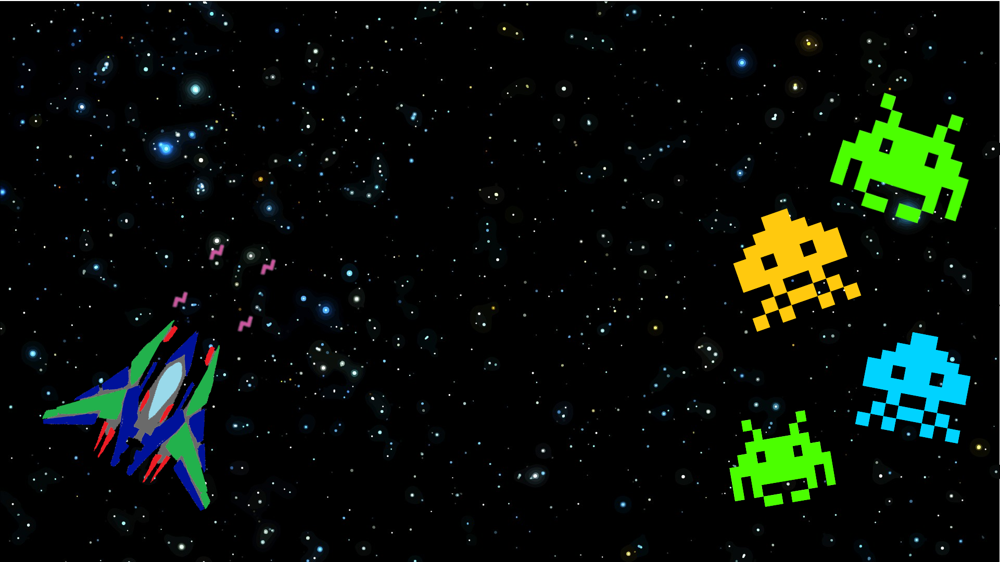

# Space Invaders 🚀



Klasyczna gra **Space Invaders** napisana w języku Java (korzystająca z biblioteki Swing/AWT), której autorem jest **Kacper Pudełko**. Gra oferuje kilka poziomów trudności, przeciwników, udźwiękowienie oraz walkę z Bossem!

## 🎮 Zasady działania programu i mechanika

1. **Poziomy trudności:** Gra posiada łącznie **5 poziomów**. 
   - Pierwsze 4 to normalne poziomy, w których stopniowo rośnie poziom trudności.
   - Poziom 5 to specjalny poziom, w którym musisz zmierzyć się z potężnym **Bossem**.
2. **Jednorazowa rozgrywka:** Każdy poziom można rozegrać tylko raz w trakcie działania programu. Aby zagrać w dany poziom ponownie, musisz zrestartować całą aplikację.
3. **Życia:** Gracz rozpoczyna z **3 życiami**. Po utracie wszystkich 3 żyć gra kończy się ekranem Game Over i przegraną.
4. **Limit amunicji:** Statek gracza może wystrzelić i utrzymywać na ekranie maksymalnie **4 naboje** równocześnie. Strzelaj z rozwagą!

## 🕹️ Sterowanie

* **Poruszanie się:** Strzałki na klawiaturze (`←` `↑` `→` `↓`) lub klawisze `W` `S` `A` `D`
* **Strzelanie:** Spacja (`Space`)

## 🛠️ Informacje techniczne

Projekt został zrealizowany w czystej Javie. Do prawidłowego działania wykorzystuje zewnętrzne pliki graficzne i dźwiękowe.

Wszystkie niezbędne pliki graficzne (`.png`) oraz dźwiękowe (`.wav`) używane przez grę znajdują się w katalogu `files/`. Ścieżki w kodzie są zaimplementowane w sposób relatywny, dzięki czemu gra zadziała natychmiast po jej poprawnym skompilowaniu i uruchomieniu (nie jest już konieczna ich modyfikacja!).

## 🚀 Jak uruchomić?

Najprostszym sposobem na szybkie włączenie gry pod systemem Windows jest dwukrotne kliknięcie przygotowanego skryptu:

👉 **`Uruchom_Gre.bat`** 

Skrypt ten automatycznie skompiluje cały projekt (do kompatybilnej wersji Java 21) oraz uruchomi okno z grą.

### Alternatywnie (dla programistów):
Jeśli wolisz korzystać z narzędzi konsolowych, możesz skompilować kod i uruchomić go samodzielnie:
```bash
# Ręczna kompilacja i uruchomienie (bez Mavena)
javac --release 21 -d target/classes src/main/java/com/mycompany/space_invaders/*.java
java -cp target/classes com.mycompany.space_invaders.Space_Invaders
```

Lub z poziomu swojego środowiska IDE (np. klikając przycisk "Run" nad plikiem `Space_Invaders.java` w Visual Studio Code).
